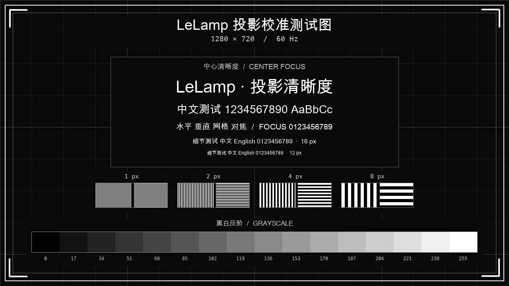

# Raspberry Pi 5 硬件配置与验证

本配置对应 2026-10-07 实机验证的 LeLamp：两路 CSI 相机、Yundea A31-1 USB 音频、串口舵机和 CX-15/CXN0102 投影组件。配置使用树莓派本机 systemd、uv、ALSA、rpicam 和原生 DRM/KMS；临时文件放在项目根目录的 `tmp`。

Ubuntu 启动链、系统/用户服务、权限、环境加载顺序及恢复操作见[系统配置与恢复](./system-configuration.md)。

配置文件用于复现硬件连接和已验证参数。它不表示完整机械臂已可运动，也不表示相机已完成调焦或模型视觉能力已验证。发布包不包含登录密码、控制台访问令牌、模型 API 密钥、私人录音照片或供应商资料原件。

需要的本机工具包括 uv、rpicam/libcamera、ALSA 工具、libdrm 与 systemd/udev；本次相机环境安装了 `rpicam-apps-core` 和 `libcamera-ipa`。新增配置/投影 Python 工具仅使用标准库及系统 `libdrm.so.2`，通过 `uv run` 执行。LeLamp 网页和原项目依赖仍按仓库既有安装方式准备；不要把这些独立工具能运行等同于整个网页应用已安装。

## 已验证的硬件与边界

| 硬件 | 本机接法/稳定标识 | 实机结果 | 使用边界 |
| --- | --- | --- | --- |
| 主机 | Raspberry Pi 5 | 本机服务、uv 和硬件接口可用 | 以本配置适配的系统和原项目依赖为基础 |
| CAM0 | IMX290，物理 CAM0 接口 | 驱动绑定成功，单帧拍照成功 | 镜头焦距与朝向仍需调整 |
| CAM1 | IMX219，物理 CAM1 接口 | 驱动绑定成功，单帧拍照成功 | 不提供可用软件自动对焦 |
| 输入/输出音频 | Yundea A31-1，ALSA 卡名 `A311` | 录音有非静音输入；用户听到测试音 | 使用稳定卡名，不固定数字声卡编号 |
| 舵机总线 | 与投影串口分开的 USB CDC 串口 | 仅 ID 1、2 响应；ID 3、4、5 未响应 | 默认禁止运动与扭矩写入 |
| RGB 灯 | 仓库提供 RGBService，但本机灯数与接线未独立核对 | 未完成独立亮灯验证 | 保持 RGB 关闭，不能宣称可点亮 |
| 投影控制 | CH340/CH341，USB VID:PID `1a86:7523` | 电源与翻转帧完整写入；最终现场确认出图 | 控制协议没有已定义的状态查询或 ACK |
| 投影视频 | HDMI-A-1，CX-15/CXN0102 组件 | 标准 720p60 彩条和校准测试图实际显示 | 无 EDID；必须核对输出的完整时序 |
| 投影方向 | 本机安装及观看方向 | 用户确认标题在上、文字左右正常、灰阶左黑右白 | 本机需 `flip-both`；换安装方式后重新确认 |

HDMI 的 `connected`、LeLamp 预览页在线或串口写入成功，都不能单独证明投影镜头已经发光。表中的投影成功以用户确认的实际画面为依据。

## 配置文件

本硬件包的配置放在 `config/hardware/raspberry-pi-5/`，运行工具放在 `scripts/hardware/`。

| 文件 | 作用 |
| --- | --- |
| `boot-config.fragment.txt` | IMX290/CAM0、IMX219/CAM1 与 KMS noaudio 启动片段 |
| `hardware.env.example` | 舵机禁动、稳定串口与 A311 音频的环境变量参考 |
| `99-lelamp-hardware.rules` | 分开建立投影与舵机 udev 别名 |
| `lelamp-web-console.conf` | 网页服务附加组及硬件变量 |
| `scripts/hardware/apply_profile.py` | 预览差异，或应用启动配置、udev、服务覆盖及 PCM 音量 |
| `scripts/hardware/projector_display.py` | 原生 KMS CEA 720p60 输出、状态与结束 |
| `scripts/hardware/projector_serial_session.py` | 长期开启串口、固定控制帧与明确结束 |
| `assets/hardware/projector-test-card.rgb` | 1280×720 RGB 原始校准图，供显示工具读取 |
| `assets/hardware/projector-test-card.jpg` | 同一校准图的可查看预览 |

硬件环境模板不包含密钥，默认 `OPENCLAW_ENABLE_HARDWARE=0`、`OPENCLAW_ENABLE_RGB=0`。应用脚本将公开硬件环境安装为 `/etc/lelamp/hardware.env`，并通过服务覆盖配置的后加载 `EnvironmentFile` 引入；只复制 `hardware.env.example` 不会使变量自动进入已有服务。环境文件优先级和原私密配置保留方式见系统说明。改变接线或设备型号时，应同时核对模板、udev 规则和服务覆盖内容。

应用配置前先检查当前 `/boot/firmware/config.txt`、服务覆盖配置和 udev 规则，并保留项目 `tmp` 下的备份。boot 片段应合并到 Pi 5 生效的段落；不要覆盖其他设备的启动配置。默认仅预览差异，在树莓派的仓库根目录执行。先指定实际已安装的 uv 路径；不下载或提交 uv 二进制到硬件配置仓库。当前调试机器的 uv 位于另一个部署目录，进入此仓库后先运行：

```sh
export LELAMP_UV_BIN=/home/z/Project/lelamp-web/bin/uv
```

其他部署可将 `LELAMP_UV_BIN` 设为已安装 uv 的绝对路径，或确保 `uv` 在 PATH 中；下列命令优先保留外部设置，再尝试本项目 `bin/uv` 和 PATH：

```sh
mkdir -p "$PWD/tmp"
LELAMP_UV_BIN="${LELAMP_UV_BIN:-$PWD/bin/uv}"
test -x "$LELAMP_UV_BIN" || LELAMP_UV_BIN="$(command -v uv)"
TMPDIR="$PWD/tmp" UV_CACHE_DIR="$PWD/tmp/uv-cache" PYTHONDONTWRITEBYTECODE=1 "$LELAMP_UV_BIN" run --no-project python scripts/hardware/apply_profile.py
```

核对预览与实物一致后再应用：

```sh
sudo env TMPDIR="$PWD/tmp" UV_CACHE_DIR="$PWD/tmp/uv-cache" PYTHONDONTWRITEBYTECODE=1 "$LELAMP_UV_BIN" run --no-project python scripts/hardware/apply_profile.py --apply
```

脚本检查目标为 Raspberry Pi 5、A311 PCM 控制与必要系统工具。遇到生效的 `include` 或无法判定的条件段时停止，要求人工核对；保留 Ubuntu 的 `os_prefix` 与非 Pi 5 条件配置。修改前备份写入项目 `tmp/hardware-profile-backup-时间/`。

应用会加载新的 systemd/udev 规则并保存目标 PCM 60%，但不会自动重启树莓派、重启网页服务、触发当前 USB 设备、切换投影电源或移动舵机。相机和 HDMI 启动项在后续重启生效；udev 别名在后续设备重新枚举后出现。先安全关闭投影，满足串口延时要求，再安排这些操作；别名出现后手动重启 `lelamp-web-console.service`。

本次现场确认成功的是项目 `tmp` 中的临时原生显示工具与串口保持工具。本包新脚本按这些已实测路径整理，目前尚未替换现场进程，也没有完成新脚本在树莓派上的全流程启动、出图和结束验证。该结果不等于已部署开机自动投影，不应把“配置模板已提供”写成“重启后会自动恢复”。

## 相机：物理接口与软件索引

本机启动配置的关键项：

```ini
camera_auto_detect=0
dtoverlay=imx290,cam0
dtoverlay=imx219
```

`cam0` 指物理 CAM0 接口；第二条 IMX219 适配本机物理 CAM1。部署时以配置包的 boot 片段为准，避免重复自动探测和手工 overlay。

用户提供的 CAM0 板号为 `RH9027-H2524P15-VO`。当前按 IMX290 overlay 的默认 37.125 MHz 时钟配置，已观察到驱动绑定并拍照成功；尚未取得该板号的厂商资料，不能声称其实际时钟要求已被厂商核实，也不能保证同板号的其他模组直接适用此参数。

成功复查时，CAM0 IMX290 绑定到 I²C `10-001a`，CAM1 IMX219 绑定到 `11-0010`。当时 rpicam 软件索引为：

- `0`：CAM0 IMX290。
- `1`：CAM1 IMX219。

软件索引不是物理接口的永久编号。相机识别顺序或某路初始化失败都会影响索引；拍照前重新枚举传感器和实际路径，不能只看到 `/dev/video0` 就判断是哪路相机。

在项目根目录执行：

```sh
mkdir -p "$PWD/tmp/camera-check"
export TMPDIR="$PWD/tmp/camera-check"
sudo env TMPDIR="$PWD/tmp/camera-check" rpicam-still --list-cameras
sudo env TMPDIR="$PWD/tmp/camera-check" rpicam-still --list-cameras -v 2
sudo env TMPDIR="$PWD/tmp/camera-check" rpicam-still --camera 0 -n -t 1000 --width 1024 --height 768 -o "$PWD/tmp/camera-check/camera0.jpg"
sudo env TMPDIR="$PWD/tmp/camera-check" rpicam-still --camera 1 -n -t 1000 --width 1024 --height 768 -o "$PWD/tmp/camera-check/camera1.jpg"
```

上面的索引仅适用于列表仍显示本机映射的情况。原 LeLamp `camera_observer.py` 使用 rpicam/libcamera 单帧拍照；网页 `POST /api/hardware/test` 可分别传入 `{"test":"camera","camera_index":0}` 和 `{"test":"camera","camera_index":1}`。使用网页测试时沿用控制台正常认证，不在命令或公共文档中写入访问令牌。

IMX290 与 IMX219 的当前控制列表均没有 `AfMode`、`AfTrigger`、`LensPosition`，设备树也没有已配置的镜头执行器。因此本机当前不能通过软件自动对焦或驱动镜头移动。`Sharpness` 是图像锐化，不是镜头焦距控制。模组是否具备可手动调焦的结构，应检查实物镜头；现有证据不能断言所有同型号模组都没有镜头马达。

若某路初始化失败，先读取驱动日志和 rpicam 列表，再检查该路的排线、接口与 overlay。本机曾出现 IMX290 初始化失败而后续重启成功，具体原因未确定；不要把这一经历当成排线或时钟故障已被证明。

## 麦克风与扬声器

Yundea A31-1 同时提供输入与输出，稳定 ALSA 设备是：

```text
plughw:CARD=A311,DEV=0
```

数字 `card 1` 只是一次枚举结果，可能改变。`hw:3,0` 是旧环境的残留默认值，不适用于本机。输入、输出和网页服务配置都使用 `A311` 卡名。

启动 overlay 使用：

```ini
dtoverlay=vc4-kms-v3d,noaudio
```

它在本配置中禁用 HDMI 音频，保留 HDMI 视频。重启后的 ALSA 和网页扬声器候选只剩 USB Audio。

网页服务需要补充组 `dialout video audio`。声卡节点属于 `audio`；只给服务 `dialout video` 会导致设备存在但服务无权录音或播放。已验证的网页输出配置为：

```ini
OPENCLAW_SPEAKER_DEVICE=plughw:CARD=A311,DEV=0
```

环境模板和网页服务覆盖中的输入变量为 `OPENCLAW_MIC_DEVICE=plughw:CARD=A311,DEV=0`。服务覆盖配置必须保留现有必要组，添加权限后重启服务才会作用于新进程。

本配置的目标 PCM 音量是 60%，用户此前明确确认该设置下能听到测试音。音量可能被系统或其他程序改动，部署后应读回确认并保存 ALSA 状态，可按以下方式检查或恢复：

```sh
aplay -l
arecord -l
sudo amixer -c A311 sget PCM
sudo amixer -c A311 sset PCM 60% unmute
sudo alsactl store A311
sudo alsactl restore A311
```

在项目根目录做短时录音/播放测试；播放会发声：

```sh
mkdir -p "$PWD/tmp/audio-check"
export TMPDIR="$PWD/tmp/audio-check"
sudo env TMPDIR="$PWD/tmp/audio-check" arecord -D plughw:CARD=A311,DEV=0 -r 16000 -c 1 -f S16_LE -d 3 "$PWD/tmp/audio-check/microphone.wav"
sudo env TMPDIR="$PWD/tmp/audio-check" aplay -D plughw:CARD=A311,DEV=0 "$PWD/tmp/audio-check/microphone.wav"
```

原 LeLamp 音频测试和网页默认麦克风/扬声器测试均已完成。麦克风录到非静音信号不等于语音识别质量已经验证；当前云端模型连接、语音识别和视觉推理不在硬件出入接口验证范围内。

## 舵机：保留只读检查，禁止直接运动

舵机串口与投影串口是两个独立设备。本机舵机接口曾枚举为 `/dev/ttyACM0`，投影 CH340 则为 `/dev/ttyUSB0`。枚举编号可能变化，使用配置包提供的专用 udev 标识，并在应用前确认 USB 属性，不能互换。

默认运行变量为 `LELAMP_PORT=/dev/lelamp-servo`、`OPENCLAW_ENABLE_HARDWARE=0`。配置包的另一别名 `/dev/lelamp-projector` 专用于投影。当前规则以每种 VID:PID 仅一只对应设备为前提；多个同型适配器时先增加能区分实物的属性，不直接套用。

只读 PING/READ 检测结果：

| 舵机 ID | 结果 |
| --- | --- |
| 1 | 有响应 |
| 2 | 有响应 |
| 3 | 未响应 |
| 4 | 未响应 |
| 5 | 未响应 |

默认配置应关闭硬件运动。未响应的节点、机械结构、关节零点、限位和负载都需要完成检查后才能另行启用。不要将“两只舵机响应”描述成“完整机械臂可用”，不要在应用硬件配置或启动服务时自动写扭矩、位置或扫动关节。

## RGB 灯：保留关闭，先核对灯数和接线

RGB 数量在现有仓库中并不一致：

| 源码/说明位置 | 数量 |
| --- | --- |
| `lelamp_runtime/main.py` 的 RGBService 调用 | 64 |
| `RGBService` 构造函数默认值 | 64 |
| `office_agent/hardware.py` 的 RGBService 调用 | 40 |
| `motor_config.py` 的 `DEFAULT_LED_COUNT` | 40 |
| 仓库根 README 的旧描述 | 24 |

这些是代码默认值和旧说明，不是本机灯数的检测结果。本次没有独立实测 RGB 灯数量、信号线、电源线或点亮效果，因此保持 `OPENCLAW_ENABLE_RGB=0`，同时保留 `OPENCLAW_ENABLE_HARDWARE=0`。两项均为项目真实配置字段；不通过发布配置自动初始化灯条。

当前 `RGBService` 默认参数和 Office Agent 显式使用的引脚等参数是 `led_pin=12`、`led_freq_hz=800000`、`led_dma=10`、`led_brightness=255`、`led_invert=False`、`led_channel=0`。这些参数只能用作核对源码的起点，不能据此证明实物接线、灯条类型、实际灯数或本机驱动后端已经正确配置。该服务依赖 `rpi_ws281x`；它在初始化时会访问硬件，当前配置不启用这一路。

后续应先按实物确认数量、接线、电源与实际运行入口，统一各入口的参数，再单独验证亮灯；不要仅将 README 的 24、主程序的 64 或默认常量的 40 当作已确定的本机规格。

## 投影供电与两个串口的区别

CX-15 光机连接长条尾板，再由 CH340/CH341 控制接口与树莓派连接。外部尾板电源要求为 **5V、供电能力至少 1A**；串口与电源必须共地，TX/RX 交叉：

- 适配器 TX → 尾板 RX。
- 适配器 RX → 尾板 TX。
- 适配器 GND、电源 GND、尾板 GND 共地。
- 外部电源正极接尾板的 5V 端子；风扇按尾板对应接口连接。

不能把光机内部的 3.7V、3.3V、1.8V 电源域当成外部尾板供电电压。资料中的内部维护 UART 460800 也不是尾板外部控制串口的波特率。

本机稳定投影串口路径为：

```text
/dev/serial/by-id/usb-1a86_USB_Serial-if00-port0
```

它目前指向 `/dev/ttyUSB0`，USB VID:PID 是 `1a86:7523`。若存在多个无独立序列号的 CH340，单靠 VID:PID 或这个通用名称无法区分设备；安装 udev 规则前核对物理连接和 USB 属性，不使用过宽规则选中其他串口。

控制参数为 **9600、8N1、无软硬件流控**。投影串口需要 `dialout` 权限；原生显示还需要 DRM 设备访问和当前显示控制权。应用配置不会自动发送电源切换指令。

## 投影视频：核对完整 720p60 时序

本机接收端没有返回 EDID，读取到的 EDID 大小为 0。此前系统默认 1024×768 并不能形成光学画面。最终成功测试使用以下标准 CEA 720p60 时序：

| 参数 | 数值 |
| --- | --- |
| 像素时钟 | 74250 kHz |
| 水平显示/同步开始/同步结束/总计 | 1280 / 1390 / 1430 / 1650 |
| 垂直显示/同步开始/同步结束/总计 | 720 / 725 / 730 / 750 |
| 同步极性 | +HSync、+VSync |
| 扫描与比例 | 逐行、60 Hz、16:9 |

仅检查分辨率名称 `1280x720` 不足以确认这一模式；命令行模式生成可能得到不同的 GTF/CVT 时序。应从 DRM 读回实际时钟、水平/垂直参数和 active 状态。设备连接状态不能替代视频时序与现场画面检查。

本配置提供 `scripts/hardware/projector_display.py`，使用本机 libdrm 原生显示路径输出完整 CEA 时序，并根据连接器和当前可用资源选取 DRM card/CRTC。不要把某次测试的 `card1`、连接器 36、CRTC 95 或 framebuffer 编号固化到其他机器。

该显示路径在本机需取得 KMS 控制权；图形登录管理器占用显示时应先按运行流程停止对应图形服务，退出后恢复。相机、音频与 LeLamp 网页服务可以继续运行。确认投影已正常关机并结束串口会话后，才能重启树莓派或恢复可能中断显示的系统操作。

本包不调用原仓库的 `generate_720p_edid.py`：它主动计算 EDID 校验值并使用系统临时目录，与本部署要求冲突。本方案直接设定和读回标准时序，不生成或改写 EDID，不改写投影器 EEPROM。

## 串口必须保持打开

原 LeLamp `micro_projector_serial.py` 的固定命令与供应商尾板协议相符，但单次发送工具会在等待约 1 秒后关闭串口，不符合本模块运行时持续打开串口的要求。新的 `scripts/hardware/projector_serial_session.py` 为本模块提供持续打开的诊断会话，明确区分发送命令和结束会话。

电源帧为：

```text
ff 07 99 00 00 00 00 a0
```

开机、关机使用同一帧，是 **power-toggle**。它没有独立“确保开启”或“确保关闭”的语义，也没有协议定义的只读电源状态或 ACK。实际完整写入 8 字节只能证明系统接受了这次写操作，不能证明尾板已收到、执行或光机已启动；曾收到的单字节 00 也不能解释为电源确认。

按模块资料，运行时保持串口打开。关机后至少继续保持 **15 秒**，再关闭串口或移除供电。显示进程和串口保持进程承担不同职责；退出其中一个不能代替安全结束另一个。

尾板指示灯约每秒闪两次通常表示待机，常亮通常表示运行。资料描述启动后约 5 秒可能出现蓝屏；约 20 秒内没有正确视频输入可能自动关闭。现场观察应覆盖启动初段，避免等自动关机后才查看。灯和风扇用于辅助判断；镜头是否发光及是否实际显示图像，仍需现场确认。

### 推荐启动与结束流程

1. 检查外部 5V 供电、共地和 TX/RX，核对投影与舵机串口，确保没有另一进程占用投影串口。
2. 启动持续打开的投影串口会话，先不自动切换电源。
3. 取得显示控制权，启动原生标准 720p60 显示工具，读回并确认完整时序。
4. 观察当前尾板状态。仅在要改变电源状态时发送一次 `power-toggle`，观察前 5～20 秒的灯、风扇和镜头，再判断结果。
5. 显示校准图并确认实际方向。对本机安装方向使用 `flip-both`；对其他安装方向重新选择并观察。
6. 正常结束时，在现场确认需要关机后发送一次切换，确认尾板进入待机和镜头熄灭，继续保持串口至少 15 秒。
7. 安全结束串口会话，再结束显示工具并恢复之前停止的图形服务。不要在光机运行中直接断开保持会话或重启树莓派。

无需反复发送两次电源帧“确保开机”；两次成功切换会回到原先状态。也不要把没有 ACK 当成必须重发的依据。

## 新投影工具的运行命令

以下步骤用于新部署或安全结束旧测试之后。当前机器如果仍运行项目 `tmp` 中的旧串口保持/显示测试进程，先通过原会话关机、现场确认待机、等待至少 15 秒后安全结束；不要同时启动第二个串口保持进程，也不要让两个程序竞争 KMS。

打开三个终端，均进入仓库根目录。在每个终端先按前述说明设置有效的 `LELAMP_UV_BIN`，再准备相同的调用函数，确保会话和控制命令使用同一个 root 身份与项目目录：

```sh
mkdir -p "$PWD/tmp"
LELAMP_UV_BIN="${LELAMP_UV_BIN:-$PWD/bin/uv}"
test -x "$LELAMP_UV_BIN" || LELAMP_UV_BIN="$(command -v uv)"
lelamp_hardware_run() {
  sudo env TMPDIR="$PWD/tmp" UV_CACHE_DIR="$PWD/tmp/uv-cache" PYTHONDONTWRITEBYTECODE=1 "$LELAMP_UV_BIN" run --no-project python "$@"
}
```

终端 1 启动串口保持会话，前台持续运行；启动本身不切换电源：

```sh
lelamp_hardware_run scripts/hardware/projector_serial_session.py serve
```

终端 2 先检查 DRM，再输出校准图。这个前台显示进程持续运行；`--manage-display-manager` 会暂时停止图形登录管理器，结束时恢复原先处于 active 的管理器：

```sh
lelamp_hardware_run scripts/hardware/projector_display.py check
lelamp_hardware_run scripts/hardware/projector_display.py serve --image assets/hardware/projector-test-card.rgb --manage-display-manager
```

终端 3 查看软件会话与视频状态：

```sh
lelamp_hardware_run scripts/hardware/projector_serial_session.py status
lelamp_hardware_run scripts/hardware/projector_display.py status
```

默认会话文件在项目 `tmp/hardware`。串口 `status` 只报告保持进程及软件会话信息，不是投影器电源/光源状态查询；显示 `status` 同样不能代替现场检查。

确认尾板目前约每秒闪两次、处于待机，且标准 720p60 持续输出后，在终端 3 发送一次开机切换；观察前 5～20 秒的实际变化：

```sh
lelamp_hardware_run scripts/hardware/projector_serial_session.py send toggle
```

对本机当前安装方向，发送两轴翻转并确认测试图方向。其他安装方式先观察再选择模式：

```sh
lelamp_hardware_run scripts/hardware/projector_serial_session.py send flip-both
```

可选择的方向命令为 `flip-both`、`flip-v`、`flip-h`、`flip-none`。它们设置投影方向，不更改 HDMI 视频时序，也不关闭保持会话。

结束时，在已知光机正在运行的前提下发送一次切换：

```sh
lelamp_hardware_run scripts/hardware/projector_serial_session.py send toggle
```

现场确认尾板进入闪烁待机、镜头熄灭后，才能执行下列结束命令。`--confirm-standby` 是操作人的状态确认，工具不会自动识别光源；它还会额外保持串口至少 15 秒。串口正常停止后再停止显示，显示工具恢复此前的图形服务：

```sh
lelamp_hardware_run scripts/hardware/projector_serial_session.py stop --confirm-standby
lelamp_hardware_run scripts/hardware/projector_display.py stop
```

串口保持终端和显示终端会在对应停止请求完成后退出。新的串口保持脚本捕获 SIGINT、SIGTERM、SIGHUP 后继续保持端口，并提示通过 `stop --confirm-standby` 显式结束；强制 kill、设备拔出或掉电仍无法保持连接。光机运行时不要直接结束串口保持进程或重启树莓派；结束操作必须以实际待机状态为前提，不能把 `--confirm-standby` 当作自动关机命令。

## 测试图和翻转模式

原 LeLamp `ProjectionService.render_calibration_pattern` 生成的是 Markdown 校准标记：`corner_border`、`center_focus_text`、`brightness_grayscale`、`grid_alignment`。原预览服务生成 HTML，不会自动把它送到物理 HDMI，也不能把生成标记称为已经投出网格。

本次按原校准定义制作了 1280×720 图像，并通过项目 `tmp` 中的临时原生 KMS 工具实际显示；本包新显示脚本由该路径整理，尚未替换现场进程。图像内容包含四角边框、网格、中英清晰度文字、灰阶与不同宽度的横纵细线。公开测试图是人工制作的校准素材，不含摄像头照片。



现场验收标准：

- 标题在上方，中文和英文从左到右阅读正常。
- 四角边框完整，没有明显裁切。
- 灰阶从左侧黑色逐级到右侧白色。
- 网格横平竖直，可区分细线和小字。

本机当前安装/观看方式需要两轴同时翻转：

```text
flip-both，参数 00：ff 07 37 00 00 00 00 3e
```

用户已确认该模式下方向完全正常。协议中的 `flip-none` 参数 03 是设备设置名称，并不保证每种安装或投影观看方向都正向；本机采用 03 时现场看到两轴均反。每次发送翻转帧后仍以实际图像确认结果，不能从完整写入推断光学方向已经正确。

## 故障判断

| 现象 | 下一步 |
| --- | --- |
| 相机能枚举但拍照超时 | 核对该传感器的实际索引、驱动日志、overlay 和排线 |
| 图像模糊 | 核对实物镜头和距离；当前无软件对焦控制，锐化不能补偿失焦 |
| 音频设备存在但网页不可用 | 检查服务附加组、`audio` 权限和稳定 ALSA 卡名 |
| 扬声器没有声音 | 检查 `A311`、PCM 音量和实际播放；不要回落到不存在的 `hw:3,0` |
| 舵机仅部分 ID 响应 | 保持禁止运动，先完成总线、电源和各节点只读检查 |
| HDMI connected 但镜头无光 | 同时核对尾板电源状态、持续串口连接和实际视频时序 |
| 短暂启动后恢复闪烁 | 观察启动期间是否有蓝屏，并检查是否持续提供标准 720p60 |
| 串口完整写入但无回复 | 协议未定义 ACK，结合尾板灯与实际出图判断，不据此盲目重发 |
| 文字倒置或镜像 | 用测试图的标题、文字与灰阶判断两个轴，选择与实际安装匹配的模式 |

如需拆插光机、尾板或排线，应先确认关机并满足延时后断电操作。当前测试没有证明曾发生固件损坏或光机损坏，不将此前无光直接归因于某个未经验证的故障。

## 验证方法

在仓库根目录，使用已确认存在的 uv 运行硬件工具测试：

```sh
mkdir -p "$PWD/tmp"
TMPDIR="$PWD/tmp" UV_CACHE_DIR="$PWD/tmp/uv-cache" PYTHONDONTWRITEBYTECODE=1 "$LELAMP_UV_BIN" run --no-project python -m unittest discover -s tests/hardware -v
```

发布前已在本地和目标树莓派执行，44 项软件测试全部通过，覆盖配置合并、默认只读、精确视频时序、像素转换、资源清理、套接字与串口命令处理。树莓派上还完成配置预览、DRM 只读检查及原生 libdrm 绑定检查；当前活动时序读回为标准 CEA 720p60。新工具没有接管现有显示或串口进程。

通过软件测试不等于新脚本已在现场完成光学出图，也不代替相机拍照、扬声器试听、RGB 接线/点亮或机械臂校准验证。

## 资料与维护范围

相机 overlay、KMS `noaudio` 参数以 [Raspberry Pi 官方 overlay 文档](https://github.com/raspberrypi/firmware/blob/master/boot/overlays/README) 为依据。供电、外部控制口、保持串口和输入规格来自用户提供的 CX-15/CXN0102 供应商资料；本页仅以原创文字记录本机需要的参数，不在公开仓库转载第三方资料原件。

本页记录实际完成的接口检查和现场确认。启动工具、配置模板、测试图与说明可用于重新部署；新脚本的树莓派完整启动验证、自动投影启动、完整机械臂运动、RGB 灯接线与点亮、自动对焦和云端 AI 视觉仍需分别完成与验证，不能由已有接口或临时测试推导为已完成。
