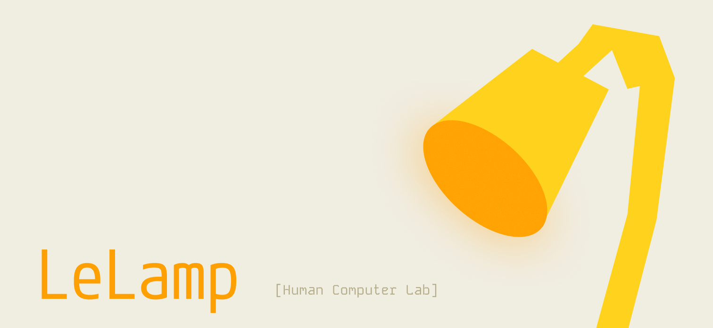

# LeLamp Runtime



This repository holds the code for controlling LeLamp. The runtime provides a comprehensive control system for the robotic lamp, including motor control, recording/replay functionality, voice interaction, and testing capabilities.

[LeLamp](https://github.com/humancomputerlab/LeLamp) is an open source robot lamp based on [Apple's Elegnt](https://machinelearning.apple.com/research/elegnt-expressive-functional-movement), made by [[Human Computer Lab]](https://www.humancomputerlab.com/)

## Overview

LeLamp Runtime is a Python-based control system that interfaces with the hardware components of LeLamp including:

- Servo motors for articulated movement
- Audio system (microphone and speaker)
- RGB LED lighting
- Camera system
- Voice interaction capabilities

## OpenClaw / XiaoAi Desktop Assistant

This runtime also includes an office desktop assistant layer under
`lelamp.office_agent`. It aims to cover XiaoAi-style daily assistant functions
while keeping desktop actions auditable.

### Manual capability tests

```bash
uv run python openclaw_cli.py p0
uv run python openclaw_cli.py manual 你会什么
uv run python openclaw_cli.py manual 计算 36*18
uv run python openclaw_cli.py manual 1米等于多少厘米
uv run python openclaw_cli.py manual 明天提醒我开会
uv run python openclaw_cli.py manual 打开 github.com
uv run python openclaw_cli.py manual 打开浏览器
uv run python openclaw_cli.py manual 音量调到 30
uv run python openclaw_cli.py manual 打开客厅灯
```

### P0 office workflows

```bash
# Local agenda/reminders with conflict detection
uv run python openclaw_cli.py remind "明天9点提醒我准备周会"
uv run python openclaw_cli.py event "明天9点 项目同步" --participant Alice
uv run python openclaw_cli.py agenda tomorrow

# Allowed-root filename + text-content search
uv run python openclaw_cli.py search "liability termination" --limit 5

# Screen capture and OCR summary when local backends are installed
uv run python openclaw_cli.py screen --summary

# Meeting transcript -> minutes + transcript export + email draft + reminders
uv run python openclaw_cli.py followup \
  --transcript meeting_transcript.txt \
  --title "项目周会" \
  --participant Alice \
  --participant Bob \
  --recipient team@example.com
```

Screen capture requires one of `gnome-screenshot`, `grim`, ImageMagick
`import`, or `spectacle`. OCR requires `tesseract` plus the relevant language
packs, or a future PaddleOCR backend.

### LeLamp-specific affordances

```bash
# Capability map and state-to-pose/light cue
uv run python openclaw_cli.py lelamp status
uv run python openclaw_cli.py lelamp state listening

# One-frame camera observation. Uses rpicam/libcamera/fswebcam or OpenCV when available.
uv run python openclaw_cli.py lelamp observe --camera-index 0

# Environment sensor event inference
uv run python openclaw_cli.py lelamp env \
  --presence \
  --lux 30 \
  --speech-active \
  --people-count 2 \
  --calendar-event-now

# Projection interaction cards
uv run python openclaw_cli.py lelamp countdown "会议确认" 60 --message "请确认行动项"
uv run python openclaw_cli.py lelamp actions "会后确认" \
  --decision "本周发布 P0" \
  --action "Alice 跟进 OCR 后端" \
  --action "Bob 校准投影区域"
```

LeLamp state cues map assistant states to RGB and recorded movements such as
`idle`, `scanning`, `curious`, `nod`, `headshake`, `shock`, and `wake_up`.
Camera observation is intentionally single-frame first; continuous object
detection should run as a sidecar such as Frigate/YOLO and feed scene events
back into this runtime.

By default desktop commands run in `audit_only` mode, which records the action
without launching apps or changing system settings. To enable deterministic
local desktop actions:

```bash
export OPENCLAW_DESKTOP_BACKEND=local
```

File search/opening is restricted to the workspace and any configured allowed
roots:

```bash
export OPENCLAW_ALLOWED_ROOTS="$HOME/Documents:$HOME/Downloads"
```

Smart-home commands use a bridge. Configure either Home Assistant:

```bash
export OPENCLAW_SMART_HOME_PROVIDER=home_assistant
export OPENCLAW_HOME_ASSISTANT_URL=http://homeassistant.local:8123
export OPENCLAW_HOME_ASSISTANT_TOKEN=<long-lived-token>
export OPENCLAW_SMART_HOME_ENTITIES='{"客厅灯":"light.living_room","卧室空调":"climate.bedroom"}'
```

or a custom webhook:

```bash
export OPENCLAW_SMART_HOME_WEBHOOK_URL=https://your-bridge.example/control
```

Phone calls, SMS, find-phone, and direct Mi Home account control require a
separate mobile or smart-home bridge with explicit account/device permission.

## Project Structure

```
lelamp_runtime/
├── main.py                 # Main runtime entry point
├── pyproject.toml         # Project configuration and dependencies
├── lelamp/                # Core package
│   ├── setup_motors.py    # Motor configuration and setup
│   ├── calibrate.py       # Motor calibration utilities
│   ├── list_recordings.py # List all recorded motor movements
│   ├── record.py          # Movement recording functionality
│   ├── replay.py          # Movement replay functionality
│   ├── follower/          # Follower mode functionality
│   ├── leader/            # Leader mode functionality
│   └── test/              # Hardware testing modules
└── uv.lock               # Dependency lock file
```

## Installation

### Prerequisites

- UV package manager
- Hardware components properly assembled (see main LeLamp documentation)

### Setup

1. Clone the runtime repository:

```bash
git clone https://github.com/humancomputerlab/lelamp_runtime.git
cd lelamp_runtime
```

2. Install UV (if not already installed):

```bash
curl -LsSf https://astral.sh/uv/install.sh | sh
```

3. Install dependencies:

```bash
# If on your personal computer
uv sync

# If on Raspberry Pi
uv sync --extra hardware
```

**Note**: For motor setup and control, LeLamp Runtime can run on your computer and you only need to run `uv sync`. For other functionality that connects to the head Pi (LED control, audio, camera), you need to install LeLamp Runtime on that Pi and run `uv sync --extra hardware`.

If you have LFS problems, run the following command:

```bash
GIT_LFS_SKIP_SMUDGE=1 uv sync
```

If your installation process is slow, use the following environment variable:

```bash
export UV_CONCURRENT_DOWNLOADS=1
```

### Dependencies

The runtime includes several key dependencies:

- **feetech-servo-sdk**: For servo motor control
- **lerobot**: Robotics framework integration
- **livekit-agents**: Real-time voice interaction
- **numpy**: Mathematical operations
- **sounddevice**: Audio input/output
- **adafruit-circuitpython-neopixel**: RGB LED control (hardware)
- **rpi-ws281x**: Raspberry Pi LED control (hardware)

## Core Functionality

Prior to following the instructions here, you should have an overview of how to control LeLamp through [this tutorial](https://github.com/humancomputerlab/LeLamp/blob/master/docs/5.%20LeLamp%20Control.md).

### 1. Motor Setup and Calibration

1. **Find the servo driver port**:

This command finds the port your motor driver is connected to.

```bash
uv run lerobot-find-port
```

2. **Setup motors with unique IDs**:

This command set up each motor of LeLamp with an unique ID.

```bash
uv run -m lelamp.setup_motors --id your_lamp_name --port the_port_found_in_previous_step
```

3. **Calibrate motors**:

This command calibrate your motors.

```bash
sudo uv run -m lelamp.calibrate --id your_lamp_name --port the_port_found_in_previous_step
```

The calibration process will:

- Calibrate both follower and leader modes
- Ensure proper servo positioning and response
- Set baseline positions for accurate movement

### 2. Unit Testing

The runtime includes comprehensive testing modules to verify all hardware components:

#### RGB LEDs

```bash
# Run with sudo for hardware access
sudo uv run -m lelamp.test.test_rgb
```

#### Audio System (Microphone and Speaker)

```bash
uv run -m lelamp.test.test_audio
```

#### Motors

```bash
uv run -m lelamp.test.test_motors --id your_lamp_name --port the_port_found_in_previous_step
```

### 3. Record and Replay Episodes

One of LeLamp's key features is the ability to record and replay movement sequences:

#### Recording Movement

To record a movement sequence:

```bash
uv run -m lelamp.record --id your_lamp_name --port the_port_found_in_previous_step --name movement_sequence_name
```

This will:

- Put the lamp in recording mode
- Allow you to manually manipulate the lamp
- Save the movement data to a CSV file

#### Replaying Movement

To replay a recorded movement:

```bash
uv run -m lelamp.replay --id your_lamp_name --port the_port_found_in_previous_step --name movement_sequence_name
```

The replay system will:

- Load the movement data from the CSV file
- Execute the recorded movements with proper timing
- Reproduce the original motion sequence

#### Listing Recordings

To view all recordings for a specific lamp:

```bash
uv run -m lelamp.list_recordings --id your_lamp_name
```

This will display:

- All available recordings for the specified lamp
- File information including row count
- Recording names that can be used for replay

#### File Format

Recorded movements are saved as CSV files with the naming convention:
`{sequence_name}.csv`

## 4. Start upon boot

If you want to start LeLamp's voice app upon booting. Create a systemd service file:

```bash
sudo nano /etc/systemd/system/lelamp.service
```

Add this content:

```bash
ini[Unit]
Description=Lelamp Runtime Service
After=network.target

[Service]
Type=simple
User=pi
WorkingDirectory=/home/pi/lelamp_runtime
ExecStart=/usr/bin/sudo uv run main.py console
Restart=always
RestartSec=5

[Install]
WantedBy=multi-user.target
```

Then enable and start the service:

```bash
sudo systemctl daemon-reload
sudo systemctl enable lelamp.service
sudo systemctl start lelamp.service
```

For other service controls:

```bash
# Disable from starting on boot
sudo systemctl disable lelamp.service

# Stop the currently running service
sudo systemctl stop lelamp.service

# Check status (should show "disabled" and "inactive")
sudo systemctl status lelamp.service
```

Note: Boot time might vary with each run and extended usage (>1 hour) can burn the motors.

## Sample Apps

Sample apps to test LeLamp's capabilities.

### LiveKit Voice Agent

## OpenClaw Office Agent Prototype

This runtime also includes a separate office-focused prototype agent:

```bash
uv run openclaw_agent.py console
```

For a text/tool agent that uses a Responses API compatible LLM in the middle:

```bash
uv run --no-sync openclaw_cli.py ask "把当前工作区文件整理成汇报提纲"
```

The CLI path is:

```text
user text or ASR transcript -> gpt-5.5 LLM -> OpenClaw context/tools -> answer or artifact
```

For no-UI local voice conversation:

```bash
uv run --no-sync openclaw_voice.py --mic-device hw:2,0 --mic-rate 48000 --speaker-device hw:3,0
```

For continuous no-UI voice conversation, omit `--turns` or set `--turns 0`:

```bash
uv run --no-sync openclaw_voice.py \
  --turns 0 \
  --seconds 5 \
  --mic-device hw:2,0 \
  --mic-rate 16000 \
  --speaker-device hw:3,0 \
  --language zh
```

Say `退出`, `停止对话`, `结束对话`, or `再见` to stop the loop.

For XiaoAI-style office assistant mode with wake phrases:

```bash
uv run --no-sync openclaw_assistant.py \
  --idle-seconds 3 \
  --listen-seconds 5 \
  --mic-device hw:2,0 \
  --mic-rate 16000 \
  --speaker-device hw:3,0
```

Say `小灯`, `小灯小灯`, `OpenClaw`, or `办公助手` to wake it. After wake,
the assistant keeps a short follow-up window for office commands.

For lower latency voice turns, use WebRTC VAD and low reasoning effort:

```bash
uv run --no-sync openclaw_assistant.py \
  --idle-seconds 2 \
  --listen-seconds 3 \
  --vad-backend webrtcvad \
  --voice-reasoning-effort low \
  --mic-device hw:2,0 \
  --mic-rate 16000 \
  --speaker-device hw:3,0
```

DashScope TTS is prewarmed and reused in the assistant process. In local tests,
the cold connection took about 5.3s, while reused synthesis reached first audio
in about 0.34-0.38s.

For the lowest-latency DashScope path, use Qwen Omni Realtime. This keeps one
WebSocket open for microphone input, model response, and speaker output:

```bash
export DASHSCOPE_API_KEY=your_bailian_key
uv run --no-sync openclaw_realtime_voice.py \
  --profile omni_realtime_v1 \
  --mic-device hw:2,0 \
  --speaker-device hw:3,0 \
  --silence-ms 600 \
  --meter
```

Useful environment overrides are `DASHSCOPE_REALTIME_MODEL`
(`qwen3-omni-flash-realtime` by default), `DASHSCOPE_REALTIME_URL`
(`wss://dashscope.aliyuncs.com/api-ws/v1/realtime` by default), and
`DASHSCOPE_REALTIME_VOICE` (`Cherry` by default). The script uses server-side
VAD for turns and interrupts local playback as soon as
`input_audio_buffer.speech_started` arrives. Per-turn latency metrics are
printed after each response and appended as JSONL to
`workspace/.voice/realtime_latency.jsonl`; override with `--latency-log`.
`omni_realtime_v1` pins the current mode: `qwen3-omni-flash-realtime`,
`Cherry`, 16 kHz input PCM, 24 kHz output PCM, `server_vad`, and 600 ms
silence detection.

Hardware feedback is optional. With `OPENCLAW_ENABLE_HARDWARE=1`, assistant
states drive RGB and LeLamp recordings:

```text
idle -> idle/dim
wake -> wake_up/warm white
listening -> scanning/blue
thinking -> curious/purple
speaking -> nod/green
error -> shock/red
```

The no-UI voice path is:

```text
local microphone -> ASR -> gpt-5.5 LLM/AI -> TTS -> local speaker
```

For Groq ASR:

```bash
OPENCLAW_ASR_PROVIDER=groq
OPENCLAW_ASR_MODEL=whisper-large-v3-turbo
GROQ_API_KEY=...
```

The office agent defaults to sandbox mode. It can only read files copied into
`workspace/` or files under roots explicitly configured with
`OPENCLAW_ALLOWED_ROOTS`.

Useful environment variables:

```bash
OPENCLAW_WORKSPACE_DIR=/path/to/workspace
OPENCLAW_AUDIT_LOG=/path/to/audit.jsonl
OPENCLAW_ALLOWED_ROOTS=/home/user/Documents:/home/user/Downloads
OPENCLAW_PERMISSION_MODE=sandbox
OPENCLAW_ENABLE_HARDWARE=0
OPENCLAW_PROJECTION_DIR=/path/to/projection_out
OPENCLAW_MEMORY_PATH=/path/to/memory.jsonl
OPENCLAW_DESKTOP_BACKEND=audit_only
OPENAI_BASE_URL=https://api.86gamestore.com
OPENAI_MODEL=gpt-5.5
OPENAI_REASONING_EFFORT=xhigh
OPENCLAW_ASR_PROVIDER=groq
OPENCLAW_ASR_MODEL=whisper-large-v3-turbo
OPENCLAW_TTS_MODEL=tts-1
OPENCLAW_TTS_VOICE=alloy
OPENCLAW_MIC_DEVICE=auto
OPENCLAW_MIC_RATE=48000
OPENCLAW_SPEAKER_DEVICE=hw:3,0
TINGWU_API_KEY=...  # Prefer loading this from .env.tingwu.local instead of shell history.
TINGWU_APP_ID=...  # Prefer loading this from .env.tingwu.local; use the Bailian Model Studio app App ID.
TINGWU_MOCK=0
TINGWU_SAMPLE_RATE=16000
TINGWU_AUDIO_FORMAT=pcm
TINGWU_LANGUAGE_HINTS=cn,en
LELAMP_PORT=/dev/ttyACM0
LELAMP_ID=lelamp
```

Set `OPENCLAW_PERMISSION_MODE=full_control` only after explicit user approval.
The current prototype records full-control desktop requests but does not yet
connect a GUI automation backend.

Tongyi Tingwu realtime meeting verification:

```bash
# Store real credentials only in an ignored local file.
cp .env.tingwu.example .env.tingwu.local
# Edit .env.tingwu.local, then load it in the terminal running live checks.
source .env.tingwu.local

# Local non-live regression suite: compile, frontend static smoke, build,
# provider protocol smoke, and mock Web API loop.
.venv/bin/python ../scripts/smoke_tingwu_local_suite.py

# Offline UI/API loop without Aliyun credentials or microphone hardware.
TINGWU_MOCK=1 LELAMP_WEB_TOKEN=test-console \
OPENCLAW_WORKSPACE_DIR=/tmp/lelamp-web-smoke-workspace \
OPENCLAW_AUDIT_LOG_PATH=/tmp/lelamp-web-smoke-audit.jsonl \
.venv/bin/python openclaw_cli.py web-console --host 127.0.0.1 --port 8898 --token test-console

.venv/bin/python ../scripts/smoke_web_api.py --base-url http://127.0.0.1:8898 --token test-console

# Protocol smoke with fake Tingwu HTTP/WebSocket and fake microphone.
.venv/bin/python ../scripts/smoke_tingwu_provider.py

# Local live preflight on the Pi without creating a cloud meeting task.
.venv/bin/python ../scripts/check_tingwu_env_file.py --env-file .env.tingwu.local
.venv/bin/python ../scripts/preflight_tingwu_live.py --capture-seconds 3

# Full live suite: preflight, direct provider verification, and Web API verification.
.venv/bin/python ../scripts/verify_tingwu_live_suite.py --env-file .env.tingwu.local --seconds 12 \
  --preflight-capture-seconds 3 \
  --spoken-phrase "乐灯听悟验收测试" \
  --evidence-dir /tmp/lelamp-tingwu-evidence

.venv/bin/python ../scripts/audit_tingwu_live_evidence.py /tmp/lelamp-tingwu-evidence/summary.json --check-files

# Live check on the Pi with a real USB/ALSA microphone and Tingwu app.
.venv/bin/python ../scripts/verify_tingwu_live.py --seconds 12 --spoken-phrase "乐灯听悟验收测试"

# Live Web Console check. Start the console first, then verify the API/UI workflow.
LELAMP_WEB_TOKEN=test-console \
.venv/bin/python openclaw_cli.py web-console --host 0.0.0.0 --port 8790 --token test-console

.venv/bin/python ../scripts/verify_tingwu_web_live.py --base-url http://127.0.0.1:8790 --token test-console --seconds 12 --spoken-phrase "乐灯听悟验收测试"
```

`TINGWU_MEETING_APP_ID` can be used anywhere `TINGWU_APP_ID` is shown above.
For this DashScope `tingwu-meeting` integration, copy the Model Studio app
App ID from Bailian 应用管理 / application configuration, not the legacy
Tingwu OpenAPI project AppKey.
`DASHSCOPE_API_KEY` can be used anywhere `TINGWU_API_KEY` is shown above.
If a key has been pasted into chat, issues, screenshots, or logs, rotate it in
Bailian first and update `.env.tingwu.local` with the new value.

The live check should create `workspace/meetings/{meeting_id}/transcript.md`,
`audio.wav`, `tingwu_ai_minutes.md`, `session.json`, `manifest.json`,
OpenClaw follow-up files, projection confirmation output, task records,
assistant notifications, and audit entries for `tingwu.meeting_start`,
`tingwu.audio_save`, `tingwu.meeting_finalize`, and `meeting_manifest`.
The live suite always writes per-stage evidence JSON and rerunnable command
diagnostics under the evidence directory; if credentials or microphone setup are
missing, inspect `summary.json`, `preflight.json`, `direct_provider.json`, and
`web_api.json` before rerunning.

Tingwu requirement-by-requirement acceptance checklist:

1. Local wiring without cloud access:
   run `.venv/bin/python ../scripts/smoke_tingwu_local_suite.py`.
   This proves the Meeting UI endpoints, provider state machine, fake
   CreateTask/GetTask/WebSocket protocol flow, task monitor, assistant
   notifications, manifests, audit events, and allowed-roots guards.
2. Pi microphone and SDK readiness without creating a cloud task:
   load `.env.tingwu.local`, then run `.venv/bin/python ../scripts/preflight_tingwu_live.py --capture-seconds 3`.
   `DASHSCOPE_API_KEY` and `TINGWU_MEETING_APP_ID` are accepted aliases.
   This proves credentials are present, DashScope TingWuRealtime imports,
   a USB/ALSA microphone is selected, a short PCM capture has non-silent signal, and
   workspace/audit paths are writable.
3. Direct live provider loop:
   load `.env.tingwu.local`, then run `.venv/bin/python ../scripts/verify_tingwu_live.py --seconds 12 --spoken-phrase "乐灯听悟验收测试"`.
   Speak `乐灯听悟验收测试` during the run. This proves live CreateTask,
   WebSocket PCM streaming, realtime transcript callbacks, stop capture,
   explicit GetTask AI minutes fetch/finalize, WAV saving, transcript saving, and secret
   redaction in workspace/audit output.
4. Web Console live loop:
   start `openclaw_cli.py web-console`, then run
   `.venv/bin/python ../scripts/verify_tingwu_web_live.py --base-url http://127.0.0.1:8790 --token test-console --seconds 12 --spoken-phrase "乐灯听悟验收测试"`.
   Speak `乐灯听悟验收测试` during the run.
   This proves the browser-facing API path, Meeting task aggregation,
   OpenClaw minutes/decisions/action items/follow-up/reminders/projection
   outputs, manifest indexing, AssistantPanel notification persistence, and
   audit visibility.
5. One-command live gate:
   run `.venv/bin/python ../scripts/verify_tingwu_live_suite.py --env-file .env.tingwu.local --seconds 12 --preflight-capture-seconds 3 --spoken-phrase "乐灯听悟验收测试" --evidence-dir /tmp/lelamp-tingwu-evidence`.
   Treat this as the final acceptance gate because it runs preflight,
   direct provider verification, and Web Console verification in isolated
   workspaces and audit logs. The suite writes `summary.json`,
   `preflight.json`, `direct_provider.json`, and `web_api.json` into the
   evidence directory so the acceptance result is inspectable after the
   terminal output scrolls away. Then run
   `.venv/bin/python ../scripts/audit_tingwu_live_evidence.py /tmp/lelamp-tingwu-evidence/summary.json --check-files`;
   it fails unless the evidence proves all required stages, outputs, task
   steps, notifications, audit/security checks, workspace boundaries, and
   referenced artifact files.

Tingwu feature-by-feature test matrix:

| Feature | Primary test | Evidence to inspect |
| --- | --- | --- |
| Provider configuration and health | `GET /api/meeting/provider/status`; covered by `smoke_web_api.py` and `verify_tingwu_web_live.py` | `providers.tongyi_tingwu.status`, `configured`, redacted `http_url`/`ws_url`, `mic_status`, `active_meeting_id` |
| Official Tingwu endpoints | `preflight_tingwu_live.py`, `verify_tingwu_live.py`, `verify_tingwu_web_live.py`, then `audit_tingwu_live_evidence.py --check-files` | `endpoint_probe.official_dashscope=true`; HTTP is `https://dashscope.aliyuncs.com/api/v1/services/aigc/multimodal-generation/generation`; WS is `wss://dashscope.aliyuncs.com/api-ws/v1/inference`; localhost/private/mock endpoints fail audit |
| Pi/USB microphone selection | `preflight_tingwu_live.py`; covered again by `verify_tingwu_live.py` | selected ALSA device, short PCM capture with `audio_bytes`/`audio_rms`/`audio_peak` > 0, nonzero WAV frames in live run |
| Realtime CreateTask | `smoke_tingwu_provider.py` for protocol shape; `verify_tingwu_live.py` for real Aliyun task | provider `task_id`/`data_id`, `tingwu.meeting_start` audit, no API key persisted |
| WebSocket PCM streaming | `smoke_tingwu_provider.py`, `smoke_web_api.py`, and `verify_tingwu_live.py` | `websocket_open`/`websocket_started` events, `websocket_audio_frames > 0`, audio bytes/seconds, `audio.wav` format 16 kHz mono S16_LE |
| Realtime transcript | `GET /api/meeting/realtime/events` and `GET /api/meeting/realtime/status` during live run | `transcript` events, `final_count`, `transcript.md`, non-empty `realtime_transcript` |
| Stop capture | `POST /api/meeting/realtime/stop`; direct provider `stop_realtime_meeting` | `meeting_stopped`, released `.tingwu_realtime.lock`, final capture session `stopped` with transcript/audio saved or explicit provider error |
| AI minutes fetch/finalize | `POST /api/meeting/realtime/fetch-minutes`; direct provider `finalize_meeting` | `tingwu.meeting_finalize`, `tingwu_ai_minutes.md`, minutes-task `dataId`, timeout/failure state remains diagnosable |
| OpenClaw minutes/decisions/actions/follow-up/reminders/projection | `verify_tingwu_web_live.py` with `run_followup=true` | task steps: `minutes`, `decisions`, `action_items`, `followup`, `reminders`, `projection_confirmation` |
| Workspace persistence | direct and Web live verifiers | `workspace/meetings/{meeting_id}/transcript.md`, `audio.wav`, `tingwu_ai_minutes.md`, `session.json`, `manifest.json`; no `.*.tmp` leftovers |
| Meeting UI wiring | `smoke_frontend_meeting_static.py`, `npm run build`, then manual browser check | realtime controls, transcript, audio seconds/WebSocket frame metrics, diagnostics, active-meeting recovery, fetch-minutes disabled while active |
| Task monitor | `GET /api/tasks` and `GET /api/tasks/{task_id}/events`; covered by Web smoke/live verifiers | compact realtime task summary including `websocket_audio_frames`, bounded event log, aggregated meeting job steps |
| AssistantPanel notifications | `GET /api/assistant/notifications`; covered by Web smoke/live verifiers | notification event for completed/warning/failed meetings, compact payload, persistent workspace notification file |
| Sandbox/audit boundaries | local suite plus direct/Web live verifiers | `permission_mode=sandbox`, `desktop_backend=audit_only`, outputs under workspace, outside-workspace manifest skips, audit entries visible |
| Secret redaction | direct/Web live verifiers | Tingwu API key absent from workspace/audit; app id absent from audit except Tingwu protocol metadata stored in session artifacts |

Manual browser pass for the final Web live run:

1. Open the Web Console and go to Meeting.
2. Confirm the Tongyi Tingwu provider card shows `available`, the selected
   microphone, and live metrics after start.
3. Start a realtime meeting, speak a short sentence, verify transcript/events
   update without refreshing.
4. Stop the meeting and wait for the workflow steps to settle.
5. Confirm the output list links to the provider artifacts, OpenClaw artifacts,
   manifest, projection confirmation, and task monitor records.
6. Open the AssistantPanel and confirm it shows the meeting completion or
   warning notification with provider/OpenClaw diagnostics when relevant.
7. Open Audit and confirm the lifecycle entries are present without secrets.

Open source project recommendations for the next integrations live in
`lelamp/office_agent/recommendations.md`.

Implemented prototype modules:

- Meeting loop: explicit meeting mode, transcript import/append, Tongyi Tingwu realtime capture, minutes, decisions, action items, follow-up email draft, reminders, projection confirmation, transcript export.
- Document loop: workspace import, text summary, rough contract/document analysis, document compare, table extraction, report outline, email draft.
- Scan loop: scanned image registration, OCR request artifact, business card OCR text parsing.
- Projection loop: markdown projection output, confirmation page, calibration plan artifact.
- Scene loop: scene event logging and workflow suggestions.
- Safety loop: sandbox/full-control mode, audit log, workspace whitelist, full-control desktop request gate.
- Memory loop: local JSONL memory store and search.

Run the lightweight smoke test:

```bash
uv run --no-sync python -m lelamp.office_agent.smoke_test
```

CLI examples:

```bash
uv run --no-sync openclaw_cli.py ask "先规划：扫描合同、提取风险、生成邮件草稿"
uv run --no-sync openclaw_cli.py manual "查看当前权限和安全状态"
uv run --no-sync openclaw_cli.py manual "查看深圳今天的天气"
uv run --no-sync openclaw_cli.py manual "联网搜索 当前AI助手都有哪些功能"
uv run --no-sync openclaw_cli.py manual "明天10点提醒我开会"
uv run --no-sync openclaw_cli.py manual "查看提醒列表"
uv run --no-sync openclaw_cli.py manual "查看今天的日程安排"
uv run --no-sync openclaw_cli.py manual "截屏一下当前屏幕"
uv run --no-sync openclaw_cli.py manual "帮我分析 manual_agent_demo.md 这个文档"
uv run --no-sync openclaw_cli.py manual "投影展示\"手动测试\"，内容是 agent 工具调用正常"
uv run --no-sync openclaw_cli.py plan "把会议纪要整理成邮件草稿"
uv run --no-sync openclaw_cli.py summarize contract.txt --style outline
uv run --no-sync openclaw_cli.py project "会议结论确认" "## Decisions\n- ..."
uv run --no-sync openclaw_voice.py --turns 1
```

Optional integration groups are declared in `pyproject.toml`:

```bash
uv sync --extra meeting
uv sync --extra documents
uv sync --extra desktop
uv sync --extra local-ai
uv sync --extra hardware
```

`openWakeWord` is recommended as a Python 3.11 sidecar service because its
`tflite-runtime` dependency does not currently provide compatible Python 3.12
wheels for this runtime.

To run a conversational agent on LeLamp, create a .env file with the following content in the root of this directory in your Raspberry Pi.

```bash
OPENAI_API_KEY=
LIVEKIT_URL=
LIVEKIT_API_KEY=
LIVEKIT_API_SECRET=
```

On how to get LiveKit secrets, please refer to [LiveKit's guide](https://docs.livekit.io/agents/start/voice-ai/). Install LiveKit CLI, then you can run the following command:

```bash
lk app env -w
cat .env.local
```

This will automatically create an `.env.local` file for you, which contains all the secrets on LiveKit side.

On how to get OpenAI secrets, you can follow this [FAQ](https://help.openai.com/en/articles/4936850-where-do-i-find-my-openai-api-key).

Then you can run the agent app by:

```bash
# Only need to run this once
sudo uv run main.py download-files

# Pick one of the below
# For Discrete Animation Mode
sudo uv run main.py console

# For Smooth Animation Mode
sudo uv run smooth_animation.py console
```

In case your lamp is not `lelamp`, change the id of the lamp inside main.py:

```py
async def entrypoint(ctx: agents.JobContext):
    agent = LeLamp(lamp_id="lelamp") # <- Chnage the name here
```

## Contributing

This is an open-source project by Human Computer Lab. Contributions are welcome through the GitHub repository.

## Maintainers
Maintained by [Human Computer Lab](https://www.humancomputerlab.com).

## Acknowledgments & Sponsors
See [CONTRIBUTORS.md](./CONTRIBUTORS.md) for contributors and their roles.  
See [SPONSORS.md](./SPONSORS.md) for sponsor thanks and how to support the project.

## License

Check the main [LeLamp repository](https://github.com/humancomputerlab/LeLamp) for licensing information.
